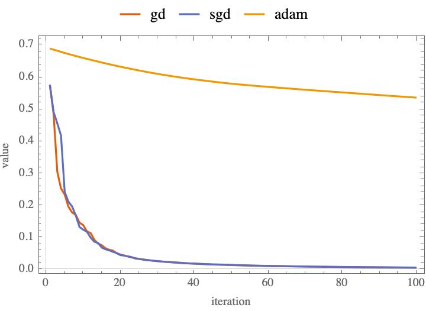
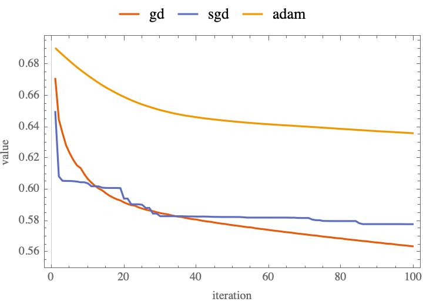
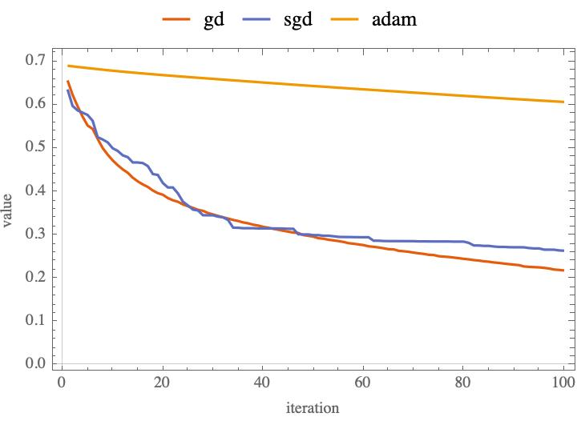

# logic regression 

## 介绍
> 使用三种优化算法 GD SGD ADAM 实现 logic regression 

## 测试条件

+ 语言标准:C++17
+ 编译器:Apple clang version 14.0.3 (clang-1403.0.22.14.1)
+ 系统:macOS13
+ 处理器:2.3 GHz 双核Intel Core i5
+ 内存:8 GB 2133 MHz LPDDR3
+ 训练数据：iris.txt
+ 分类方法：OvR

## 运行结果

+ 收敛性分析
 
 


+ 运行结果

```shell
method:gd iteration:100,accuracy:0.946667,time:2ms
method:sgd iteration:100,accuracy:0.913333,time:6ms
method:adam iteration:4000,accuracy:0.953333,time:21ms
```

## 结论

> 在小数据范围内，GD，SGD比ADAM更有优势。